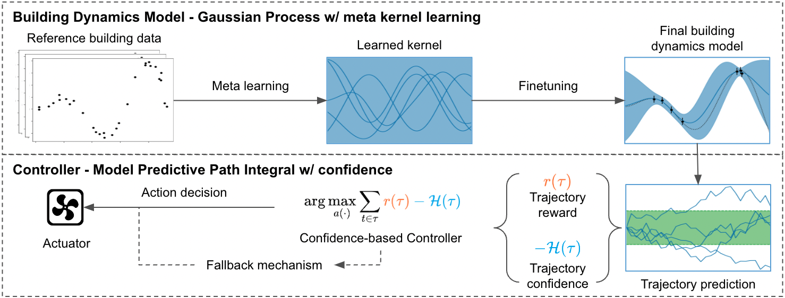

# CLUE

This is the companion project repository for [CLUE: Safe Model-Based RL HVAC Control Using Epistemic Uncertainty Estimation](). If you found our work helpful in your research, please cite it using the following reference:

```
@inproceedings{an2023clue,
    author = {An, Zhiyu and Ding, Xianzhong and Rathee, Arya and Du, Wan},
    title = {CLUE: Safe Model-Based RL HVAC ControL Using Epistemic Uncertainty Estimation},
    booktitle = {The 10th ACM International Conference on Systems for Energy-Efficient Buildings, Cities, and Transportation (BuildSys '23)},
    year = {2023},
    location = {Istanbul, Turkey},
    publisher = {ACM},
    address = {New York, NY, USA},
    url = {https://doi.org/10.1145/3600100.3623742},
    doi = {10.1145/3600100.3623742},
}
```

### Description



CLUE is a novel Model-Based Reinforcement Learning (MBRL) approach to efficient heating, ventilation, and air conditioning (HVAC) control that considers the uncertainty in model predictions caused by insufficient historical data.

It is often difficult or costly to obtain a dataset large and comprehensive enough to train a robust and accurate system dynamics model. As a result, long training time has been the key issue around MBRL for HVAC control. To the best of our knowledge, we are the first to attempt addressing this issue through explicit epistemic uncertainty estimation.

Our method consists of two parts, namely, meta kernel learning and confidence-based control. You can read more about it in our paper.

### Our Dataset

To facilitate future research, we generated and processed a dataset and created a companion `data_manager` class in the `./data` folder. `X` in the file names means that the file contains inputs for the system dynamics model, `Y` means that the file contains the corresponding outputs (the ground truth prediction). These are historical data generated by the EnergyPlus simulation for four cities: 'Port Angeles, WA', 'Pittsburgh, PA', 'Tucson, AZ', 'New York, NY'. The data spans one year for each city at a time_step interval equivalent to fifteen minutes in clock time. For the weather profiles and the building `.idf` files, please refer to the [documentation](https://ugr-sail.github.io/sinergym/compilation/main/index.html) of the simulation platform [Sinergym](https://github.com/ugr-sail/sinergym).

### Install Required Packages
The following two packages were used.    
- [Sinergym](https://github.com/ugr-sail/sinergym)
    - This package creates an environment following Gymnasium interface, for wrapping EnergyPlus simulation engine for building control using deep reinforcement learning.
    - Install the package following its [documentation](https://ugr-sail.github.io/sinergym/compilation/main/index.html).
    - **Please note!** To better incorporate our method with the simulation environment, we made changes to the Sinergym package. As a result, the code may not run on the latest version Sinergym. As a solution, we included the Sinergym package used at the time we did the project. You can find the package in the `./sinergym` folder.
- [GPytorch](https://github.com/cornellius-gp/gpytorch)
    - This package is a highly efficient Gaussian process library implemented using PyTorch.
    - Install the package following its [documentation](https://docs.gpytorch.ai/en/latest/) and make sure you have the compatible version of Pytorch.

Install other packages by, 
```
$ pip install -r requirements.txt
``` 

### License

MIT License

Copyright (c) 2023 Zhiyu An

Permission is hereby granted, free of charge, to any person obtaining a copy
of this software and associated documentation files (the "Software"), to deal
in the Software without restriction, including without limitation the rights
to use, copy, modify, merge, publish, distribute, sublicense, and/or sell
copies of the Software, and to permit persons to whom the Software is
furnished to do so, subject to the following conditions:

The above copyright notice and this permission notice shall be included in all
copies or substantial portions of the Software.

THE SOFTWARE IS PROVIDED "AS IS", WITHOUT WARRANTY OF ANY KIND, EXPRESS OR
IMPLIED, INCLUDING BUT NOT LIMITED TO THE WARRANTIES OF MERCHANTABILITY,
FITNESS FOR A PARTICULAR PURPOSE AND NONINFRINGEMENT. IN NO EVENT SHALL THE
AUTHORS OR COPYRIGHT HOLDERS BE LIABLE FOR ANY CLAIM, DAMAGES OR OTHER
LIABILITY, WHETHER IN AN ACTION OF CONTRACT, TORT OR OTHERWISE, ARISING FROM,
OUT OF OR IN CONNECTION WITH THE SOFTWARE OR THE USE OR OTHER DEALINGS IN THE
SOFTWARE.